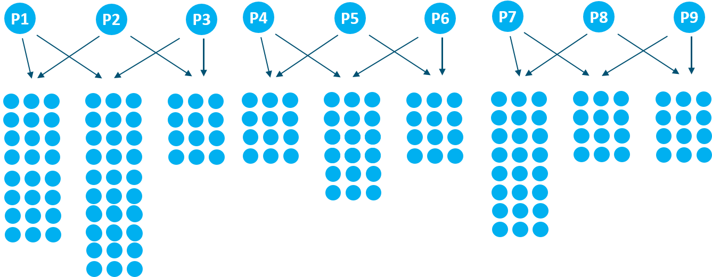
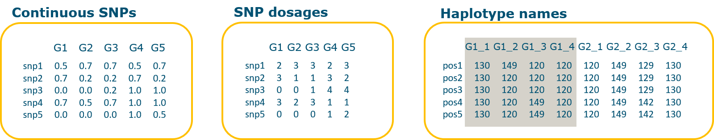

# Introduction
The present vignette will show how to use `mpQTL` to run a QTL analysis. `mpQTL` is an R package for single marker association analysis in structured populations of any ploidy (e.g. multiparental populations, diversity panels or a combination of them). Input genotypic data can be both biallelic (continuous or discrete SNP data) or multiallelic (haplotypes). 
 

```{r data_load1,echo=F}
source("../R/utils_fun.R")
data <- readRDS("new_workshop_data.RDS")

```

# Population design
The following analysis will be run on a simulated multiparental population, consisting of a set of connected F1 families (see the figure below).


 
Pedigree information can be provided by using a table with 3 columns for individual name, mother name and father name respectively.  
```{r}
## pedigree file
ped <- read.table("cross_workshop.ped", header = T, stringsAsFactors = F)
head(ped,15)

## parents used in each cross
parents <- as.matrix(unique(ped[!is.na(ped[,2]) & !is.na(ped[,3]),2:3]))
parents


```


# A note on haplotyping
In highly diverse and structured populations, precision and power of QTL detection might be increased by using ancestral alleles instead of SNP alleles. Ancestral alleles represent the actual alleles segregating in the population at a certain locus. For this reason, they are expected to explain the phenotypic variance better than biallelic SNPs. Unless a direct haplotyping technique is used, ancestral alleles are not observed. Rather, they need to be estimated by phasing a set of SNP markers. In our approach, haplotyping (phasing) can be performed by `PolyHaplotyper`, that takes advantage of connected F1 families (F1s sharing one parent).
Although haplotyping is not the focus of this vignette, we will briefly recall the main steps to run `PolyHaplotyper`. 

## Provide parents and family membership
The distinction between mother and father is used in the haplotyping algoritm. Therefore, progenies of reciprocal crosses should be indicated as belonging to the same family.

```{r}
## merge reciprocal crosses
for(i in 1:nrow(parents)) {
  parents[i,] <- parents[i, order(parents[i,])]
}
parents <- as.matrix(unique(parents[,1:2]))
parents

F1 <- list()
for (p in seq_len(nrow(parents))) {
  F1[[p]] <- ped[,1][(!is.na(ped[,2]) & !is.na(ped[,3]) & ped[,2]==parents[p, 1] & ped[,3]==parents[p, 2]) |
                       (!is.na(ped[,2]) & !is.na(ped[,3]) & ped[,2]==parents[p, 2] & ped[,3]==parents[p, 1])]
}
str(F1)


```

## Make haploblocks
`PolyHaplotyper` performs phasing of predefined sets of maximum 8 SNPs (haploblocks). In the example illustrated in this vignette, a reference genetic map is available. Therefore, haploblocks were generated based on SNP genetic position.

```{r, collapse=T}
## genetic map
map <- data$map
head(map)
table(map$chromosome) # number of markers per chromosome
tapply(map$position, map$chromosome, range) # chromosome lenght
```

In the following chunk, two functions will be used to: 

1. create adjacent blocks of 1 cM along the genome
2. refine blocks with more than a maximum number of SNPs (argument nmrk), selecting a random set of SNPs or splitting the block into smaller blocks (see argument method).

```{r, collapse=T}
## create blocks by a sliding window
hb_list <- map2blocks(map=map[map$chromosome != 0,], #excluding chrom 0
                       winsize=1, # window size
                       sldpace=1) # window step (sliding pace)

length(hb_list)
table(sapply(hb_list, length))
names(hb_list)[1:5]

## refine blocks with more than 8 SNPs
set.seed(3)
hb_list <- refineBlocks(hb_list,   # haploblock list
                        nmrk=2:7,  # numeric vector indicating allowed block length
                        method="random",
                        nrand = 2) # number of random selections per block
names(hb_list)[1:5]

```


## Haplotype inference
The objects we just created are used as input in `PolyHaplotyper::inferHaplotypes`. Do not run it. In this vignette we will use true haplotypes obtained from our simulation. They are in the same format of `PolyHaplotyper` results.
```{r}
# ## infer haplotypes by PolyHaplotyper (DO NOT RUN)
# results <- inferHaplotypes(mrkDosage=snp, ploidy=4,
#                            haploblock=hb_list,
#                            parents=parents, F1=F1,
#                            maxmrk=7)

## get true haplotypes from the simulation
PolyHap_res <- data$PolyHap_res
str(PolyHap_res[[1]])
```
`PolyHaplotyper` output is a list, where each element is a list of results related to one haploblock. Haplotype information is stored in the object called *hapdos* in form of haplotype dosages (with haplotypes in rows and individuals in columns).
```{r}
PolyHap_res[[1]]$hapdos[,1:3] #first block, 21 haplotypes, first 3 individuals
```


## Haplotype curation and format conversion
After haplotype inference, blocks can contain missing values for the individuals with more than one possible phasing solution. Therefore, haplotype data curation is recommanded before performing QTL mapping. In addition, the output of PolyHaplotyper (haplotype dosages) needs to be converted in an appropriate input format for `mpQTL`(haplotype names, see next section). The function `HapCurate` can be used to simultaneusly screen for missingness per block and convert *haplotype dosages* into *haplotype names* (see next section). SNPs of discarded blocks can be re-included (use.SNPs = T). `HapCurate` returns a list of two elements:

- genotypes: curated genotypes in form of *haplotype names*
- map: a map for hapoblocks (and SNP, if included)
```{r}
hapres <- HapCurate(PolyHap_res,  # results of PolyHaplotyper
                    hb_list = hb_list, #may contain also 1-SNP blocks
                    map = map,
                    ploidy = 4,
                    na.rate = 1,  # allowed missingness per marker
                    use.SNPs = F, # whether you want to include SNPs of discarded blocks
                    snpdose = snp)

hap <- hapres$genotypes  # haplotypes
hapmap <- hapres$map     # haplotype map
```


# Types of genetic data accepted by `mpQTL`
`mpQTL` can use as input different types of genotypic data:

- **continuous SNP genotypes** (e.g. ratios of SNP array intensities or SNP read counts)
    A matrix of continuous genotypes, e.g. array intensity allelic ratios (Y/(X+Y)), with markers in      rows and individuals in columns.
- **SNP dosages** 
    A matrix of SNP dosages, with markers in rows and individuals in columns.
- **haplotype names**
    A matrix representing the haplotype composition of each individual, where markers (haploblocks)       are in rows and individual homologues are in columns.
- **haplotype dosages or probabilities** (not implemented yet)
    A list where each element is a matrix of haplotype dosages (or probabilities), with haplotypes in     rows and individuals in columns.


 
 

```{r}
## SNP dosages
snp <- as.matrix(data$snp)
snp[1:5,1:4]

## Haplotype names
hap[1:5,1:8]

```

In addition to `HapCurate`, a set of functions for conversion among those formats are separately provided. See the examples below.

```{r}
## from (a list of) haplotype dosages to haplotype names
eg1 <- HapdoseToHapname(PolyHap_res[1:3], ploidy = 4)
eg1[,1:8]

## from SNP dosages to haplotype names
eg2 <- SNPdoseToHapname(snp[1:5,1:4], ploidy = 4)
eg2

## from haplotype names to haplotype dosages
eg3 <- HapnameToHapdose(eg1)
str(eg3)
eg3[[1]][,1:3]
```


